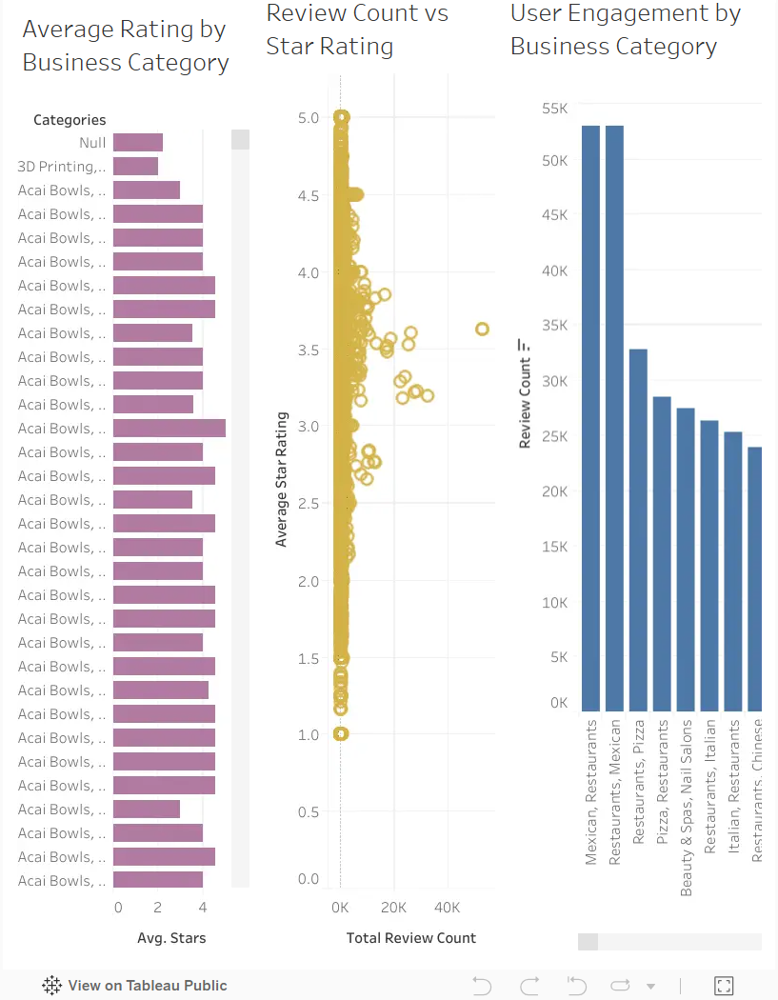

# 📊 Business Review Analytics Dashboard

## Private Data Analytics Project

An interactive data visualization project developed using Tableau to analyze business performance, customer engagement, ratings, and review patterns.

The dashboard transforms raw business data into meaningful insights by exploring relationships between business categories, customer reviews, ratings, and engagement levels.

---

# 📌 Project Overview

Customer reviews and ratings provide important information about business performance and customer satisfaction.

This project analyzes business review data to identify:

- Popular business categories
- Customer engagement patterns
- Rating distributions
- Review volume trends
- Category-level performance

The dashboard provides a visual representation of business insights using Tableau.

---

# 🎯 Project Objectives

The main objectives of this project are:

- Analyze business category performance
- Understand customer review behaviour
- Compare rating trends
- Identify highly engaged business categories
- Convert raw data into actionable insights

---

# 🖥 Dashboard Preview

## Overall Analytics Dashboard

The dashboard provides an overview of business performance using multiple interactive visualizations.

It includes:

- Average rating analysis
- Review count comparison
- Customer engagement by category


### Dashboard Screenshot




---

# ✨ Dashboard Features

## ⭐ Average Rating by Business Category

Shows the average customer rating across different business categories.

Helps identify:

- High-rated categories
- Customer satisfaction levels
- Rating differences between businesses


---

## 📈 Review Count vs Star Rating

Analyzes the relationship between:

- Number of reviews
- Average star rating

This helps understand whether highly reviewed businesses maintain strong customer ratings.

---

## 👥 User Engagement Analysis

Displays customer interaction levels by business category.

Provides insights into:

- Most active categories
- Customer interest
- Review contribution


---

# 🔍 Key Questions Answered

This dashboard helps answer:

- Which categories receive higher ratings?
- Which businesses have stronger customer engagement?
- Does review count affect rating performance?
- Which categories attract more customer interaction?

---

# 🏗 Dashboard Workflow

```
Raw Dataset

      ↓

Data Cleaning

      ↓

Data Preparation

      ↓

Data Analysis

      ↓

Tableau Visualizations

      ↓

Business Insights

```

---

# 🛠 Technologies Used

## Data Visualization

- Tableau


## Data Processing

- Data Cleaning
- Data Transformation


## Analysis

- Exploratory Data Analysis (EDA)
- Business Intelligence


## Development Tool

- Tableau Desktop / Tableau Public

---

# 📂 Project Structure

```
Business-Review-Analytics/

│
├── dataset/
│   └── business_reviews.csv
│
├── Tableau/
│   └── Business_Analytics_Dashboard.twbx
│
├── screenshots/
│   └── dashboard-home.png
│
└── README.md

```

---

# 🚀 How To Use

1. Download the Tableau workbook.

2. Open:

```
Business_Analytics_Dashboard.twbx
```

using Tableau Desktop.

3. Explore dashboard filters and visualizations.

---

# 📊 Analysis Areas

The project focuses on:

- Customer satisfaction analysis
- Review behaviour analysis
- Category performance
- Engagement trends
- Business insights

---

# 🔐 Project Privacy

This is a private analytics project.

The dataset processing, dashboard design, and analysis workflow are maintained privately.

---

# 🚀 Future Improvements

Possible improvements:

- Real-time dashboard connection
- Automated data refresh
- Predictive customer rating analysis
- Sentiment analysis of reviews
- Advanced business recommendations
- Interactive geographic analysis

---

# 👨‍💻 Developed By

Data Analytics Project | Built ❤️ by <a href="https://github.com/IleeshaUdari"><strong>M.G.Ileesha Udari Sasmitha</strong></a>

Tableau Business Intelligence Dashboard

```
